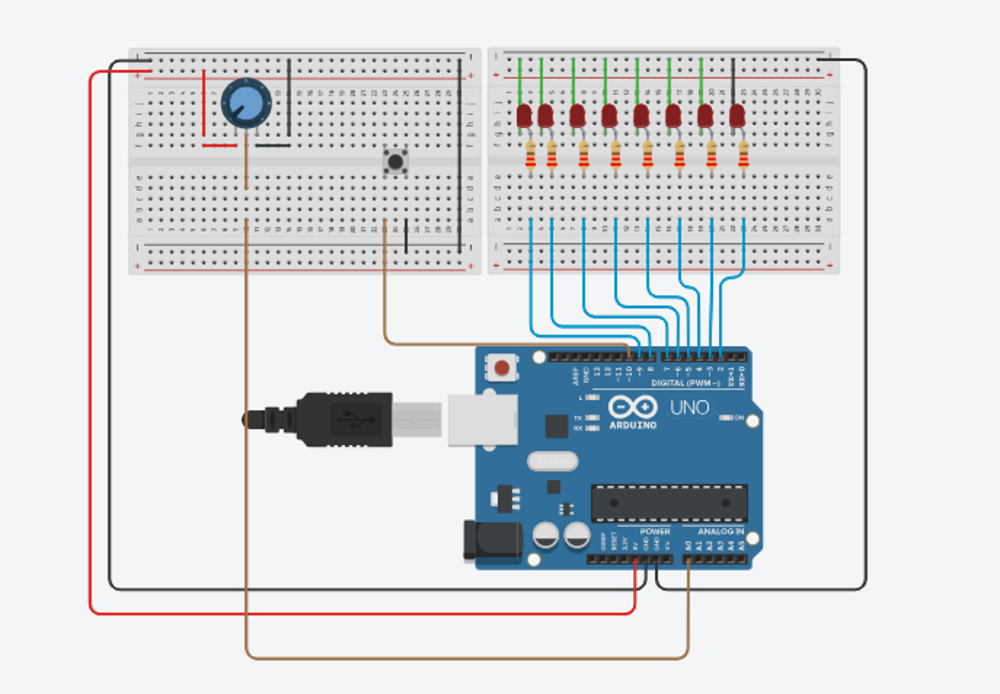
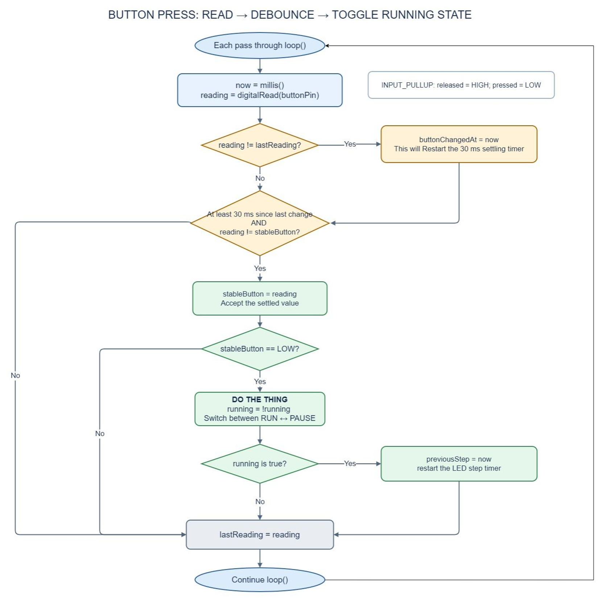

# ENGN 3340 Arduino Workshop 1

Build one circuit, then grow the code from reading inputs to a responsive LED controller. The sketches are meant to be opened **in order**. Each adds one idea to the previous one.

## What you need

- Arduino Mega 2560, breadboard, and USB cable
- Eight LEDs and **one current-limiting resistor per LED**
- Pushbutton, potentiometer, and jumper wires
- Arduino IDE and its Serial Monitor

## Wiring

| Part | Arduino Mega connection |
| --- | --- |
| Eight LEDs | Digital pins **22–29**, each through its own resistor, returning to GND |
| Button | Pin **2** to GND; the sketches enable the internal pull-up |
| Potentiometer | Outer legs to **5V** and **GND**; middle leg (wiper) to **A0** |

With `INPUT_PULLUP`, the released button reads **HIGH (1)** and a pressed button reads **LOW (0)**. Leave pins 0 and 1 free for USB Serial. The Tinkercad Uno circuit shown in the slides uses different LED pin numbers; use the Mega pin map above for these sketches.

### Circuit figure

**Figure 1.** The Tinkercad circuit uses an **Uno** to show the connections. For the **Mega** workshop sketches, follow the pin numbers in the wiring table above (LEDs 22–29, button 2, pot A0).

## Work through the sketches

| Sketch | What to try |
| --- | --- |
| [01_inputs_serial](01_inputs_serial/01_inputs_serial.ino) | Open Serial Monitor at **9600 baud**. Press the button and turn the potentiometer. Predict the readings before you look. |
| [02_led_array](02_led_array/02_led_array.ino) | Change the initial `currentLed` value, upload again, and predict which physical LED will light. Valid indexes are 0–7. |
| [03_delay_sequence](03_delay_sequence/03_delay_sequence.ino) | Watch the LED move. Tap the button quickly: does Serial Monitor always catch the press while `delay(500)` is running? |
| [04_millis_sequence](04_millis_sequence/04_millis_sequence.ino) | Compare with 03. The loop checks the button continuously while LED steps and pot printing each have their own timer. |
| [05_run_pause](05_run_pause/05_run_pause.ino) | Turn the knob to change speed. Press once to pause and again to run. Trace how the 30 ms debounce check accepts one stable press. |

Each sketch has comments that explain its sections and the reasoning behind them. Read a small section, predict what it will do, then test that prediction on the board.

### Button algorithm in sketch 05

**Figure 2.** Each pass through `loop()` compares the raw button reading with the last reading. Once a new state has stayed steady for 30 ms, a LOW press toggles `running`; a release only updates the stable state.

## Open the files

On GitHub, choose **Code → Download ZIP**, unzip it, and open the `.ino` file inside the sketch folder you want to run. In Arduino IDE, select **Arduino Mega or Mega 2560** and the board's port before uploading. You can also inspect the code on GitHub without downloading it.

The [workshop slides](ENGN%203340%20Arduino%20Workshop%201.pptx) provide the circuit and explanations. The scanner challenge appears in the slides; its completed solution is not part of the student repository.

## More detailed coding tutorials

If you want a slower walkthrough after the workshop, these two videos go into more detail:

- [Coding tutorial 1](https://www.youtube.com/watch?v=BLrHTHUjPuw&t=64s)
- [Coding tutorial 2](https://www.youtube.com/watch?v=zJ-LqeX_fLU&t=1706s)

## When something does not work

Start with the observable values: check that the button changes between 1 and 0, the potentiometer reading changes as you turn it, and `currentLed` stays between 0 and 7. Then check the circuit's GND, LED polarity, resistor, pin numbers, and selected board/port.
